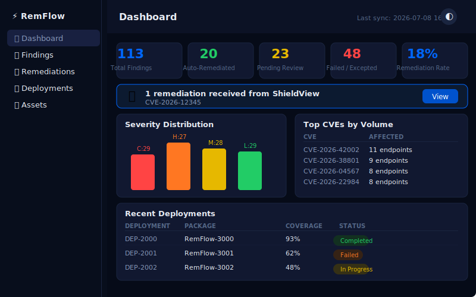

# RemFlow — Remediation Intelligence

[](https://mrdchiang.github.io/security-tools/)
[](https://mrdchiang.github.io/remflow/)

A standalone, self-contained HTML dashboard for vulnerability remediation and patch deployment. Part of the ShieldView family of security tools.

**Live:** https://mrdchiang.github.io/remflow/

---

## What It Does

RemFlow ingests vulnerability findings (from ShieldView or any source), groups affected assets by CVE, deploys patches via simulated SCCM/PDQ-style workflows, and tracks deployment progress across your fleet.

| Feature | Description |
|---------|-------------|
| 📊 Dashboard | Total findings, auto-remediation rate, severity distribution, top CVEs, recent deployments |
| 🔍 Findings | Searchable/filterable table with severity tabs, CVE names, asset counts, status badges |
| 🛠️ Remediations | Remediation batches grouped by CVE with target count, status, coverage % |
| 📦 Deployments | Deployment history with package details, per-asset progress, success rate |
| 🖥️ Assets | Asset inventory with hostname, OS, location, IP, finding counts |
| 🔗 Cross-Tool | Receives findings from ShieldView via localStorage bridge, hands off to TheValidator |

### Demo Screenshots

#### Dashboard


The dashboard shows:
- **5 stat cards:** Total findings, auto-remediated, pending review, failed/excepted, remediation rate
- **Severity distribution bar chart** (Critical, High, Medium, Low)
- **Top CVEs by volume** table
- **Recent deployments** table
- **Cross-tool banner** when ShieldView sends pending remediations

#### Findings Page


- Tab switcher: All / Critical / High / Medium / Low
- Search by CVE or asset name
- Table: CVE, Name, Affected Assets, Status, First Seen
- Click any row → finding detail page showing affected assets list
- Export CSV button

#### Remediations Page


- Status filter tabs
- Search by CVE or name
- Table: ID, CVE, Targets, Status, Coverage %, Created
- Click any row → remediation detail with deploy action button

#### Deployments Page


- Table: Deployment ID, Package, Coverage %, Status, Start, End
- Click any row → deployment detail with per-asset progress
- Animated deployment modal on "Deploy Now"

---

## Architecture

```
┌──────────────┐     localStorage      ┌──────────────┐     localStorage      ┌──────────────┐
│  ShieldView  │ ──────────────────→  │   RemFlow    │ ──────────────────→  │ TheValidator │
│  (Vuln Mgmt) │  remediation-queue    │  (Remediate) │  validated-           │  (Verify)    │
└──────────────┘                       └──────────────┘  remediations        └──────────────┘
```

All three tools are single-file `.html` docs hosted under `mrdchiang.github.io`. They share `localStorage` at that origin.

### localStorage Keys

| Key | Written By | Read By | Format |
|-----|-----------|---------|--------|
| `security-tools:remediation-queue` | ShieldView (sendToRemFlow) | RemFlow | Array of `{cve, title, severity, from, timestamp, status}` |
| `security-tools:validated-remediations` | RemFlow (markRemediationComplete) | TheValidator | Array of `{cve, title, severity, status, validatedAt}` |

### Cross-Tool Functions

```javascript
// Read pending remediations from ShieldView
function checkCrossToolQueue() {
  try {
    return JSON.parse(localStorage.getItem('security-tools:remediation-queue') || '[]')
      .filter(i => i.status === 'pending');
  } catch(e) { return []; }
}

// Mark a remediation complete → writes to validated list for TheValidator
function markRemediationComplete(cveId) {
  try {
    const queue = JSON.parse(localStorage.getItem('security-tools:remediation-queue') || '[]');
    const updated = queue.map(i => i.cve === cveId
      ? {...i, status: 'deployed', completedAt: new Date().toISOString()} : i);
    localStorage.setItem('security-tools:remediation-queue', JSON.stringify(updated));
    // Also add to validated list
    const validated = JSON.parse(localStorage.getItem('security-tools:validated-remediations') || '[]');
    const item = queue.find(i => i.cve === cveId);
    if (item && !validated.find(v => v.cve === cveId)) {
      validated.push({...item, status: 'validated', validatedAt: new Date().toISOString()});
      localStorage.setItem('security-tools:validated-remediations', JSON.stringify(validated));
    }
  } catch(e) {}
}
```

---

## To Build This For Real

RemFlow is a **client-side demo** — all data is generated from JavaScript arrays. To build a production version:

### Step 1: Data Sources
Replace the inline fake data with real API calls:

| Data | Fake Source | Real Source |
|------|------------|-------------|
| Assets & findings | `HOSTS[]`, `CVE_IDS[]`, `CVE_NAMES{}` | Tenable API, Qualys API, Defender API |
| Remediation status | `remediations[]` array | ServiceNow, Jira, or custom patch DB |
| Deployment status | `deployments[]` array | SCCM, PDQ, Intune, WSUS, Ansible |
| Asset inventory | `assets[]` array | CMDB, Active Directory, Lansweeper |

### Step 2: API Integration Points
```javascript
// Replace these with real API calls
async function fetchFindings() {
  const resp = await fetch('/api/tenable/findings?status=Active');
  return resp.json();
}

async function fetchDeployments() {
  const resp = await fetch('/api/sccm/deployments?limit=20');
  return resp.json();
}

async function triggerDeployment(remediationId, targets) {
  const resp = await fetch('/api/sccm/deploy', {
    method: 'POST',
    body: JSON.stringify({ remediationId, targets })
  });
  return resp.json();
}
```

### Step 3: Backend Recommendations
- **API Gateway:** Azure API Management or Kong
- **Auth:** OAuth2 / Azure AD with RBAC
- **Data Store:** PostgreSQL for findings + remediation state
- **Cache:** Redis for dashboard aggregates
- **Deployment Engine:** SCCM, PDQ Deploy, or Ansible Tower API
- **Notifications:** Email/Slack/Teams via webhook on completion

### Step 4: Production Concerns
| Concern | Mitigation |
|---------|-----------|
| **Auth** | Add JWT token check on each page load |
| **CORS** | API server must allow `mrdchiang.github.io` origin |
| **Real-time** | Replace polling with WebSocket or SSE |
| **Persistence** | Replace localStorage with API POST/PUT |
| **Error handling** | Add retry logic, toast notifications, error boundaries |
| **Accessibility** | Add ARIA labels, keyboard nav, screen reader support |
| **Performance** | Paginate findings table, lazy-load asset details |

---

## Data Shape

```javascript
// Asset
{ hostname: "WEB-PROD-03", os: "Windows Server 2022",
  loc: "US-East (nyc1)", ip: "10.23.12.45",
  findings: [{ cve, name, severity, kb, status, firstSeen, lastUpdated, fixAvailable }],
  lastScan: "2026-07-08 12:00" }

// Remediation batch
{ id: "RM-1000", cve: "CVE-2026-12345", name: "Log Library Remote Code Execution",
  targets: ["WEB-PROD-03", "APP-PROD-07"], targetCount: 2,
  status: "In Progress", created: "2026-07-05", completed: "—", coverage: 65 }

// Deployment
{ id: "DEP-2000", package: "RemFlow-3000",
  type: "Software Update Package", targetCount: 15,
  successRate: 95, start: "2026-07-07", end: "2026-07-07", status: "Completed" }
```

### Status Values (all generic)
| Field | Values |
|-------|--------|
| **Finding Status** | Active, Fixed, Mitigated, False Positive, Risk Accepted |
| **Remediation Status** | Queued, In Progress, Completed, Failed, Rolled Back |
| **Deployment Status** | Completed, In Progress, Failed, Rolled Back |

### Critical Rule: No Vendor Names
All software, product, and CVE names are generic descriptions:
- ✅ `Log Library Remote Code Execution`, `Print Service Elevation of Privilege`
- ✅ `Mail Server Remote Code Execution`, `OS Kernel Privilege Escalation`
- ❌ `Log4j`, `PrintNightmare`, `Exchange RCE`, `CrowdStrike`

---

## Deployment

```yaml
# .github/workflows/pages.yml
name: Deploy to GitHub Pages
on:
  push:
    branches: [main]
permissions:
  contents: read
  pages: write
  id-token: write
jobs:
  deploy:
    environment:
      name: github-pages
      url: ${{ steps.deployment.outputs.page_url }}
    runs-on: ubuntu-latest
    steps:
      - uses: actions/checkout@v4
      - uses: actions/configure-pages@v5
      - uses: actions/upload-pages-artifact@v3
        with:
          path: '.'
      - id: deployment
        uses: actions/deploy-pages@v4
```

Repo needs:
- `index.html` (the tool)
- `.nojekyll` (empty file)
- `.github/workflows/pages.yml` (auto-deploy)
- `404.html` (hash routing fallback)

---

## Files

| File | Purpose |
|------|---------|
| `index.html` | Main application (single-file) |
| `.nojekyll` | Disables Jekyll processing on GH Pages |
| `.github/workflows/pages.yml` | Auto-deploy workflow |
| `404.html` | Hash routing fallback for direct URLs |
| `README.md` | This file |

---

Built by David Chiang · [mrdavidchiang@gmail.com](mailto:mrdavidchiang@gmail.com)
